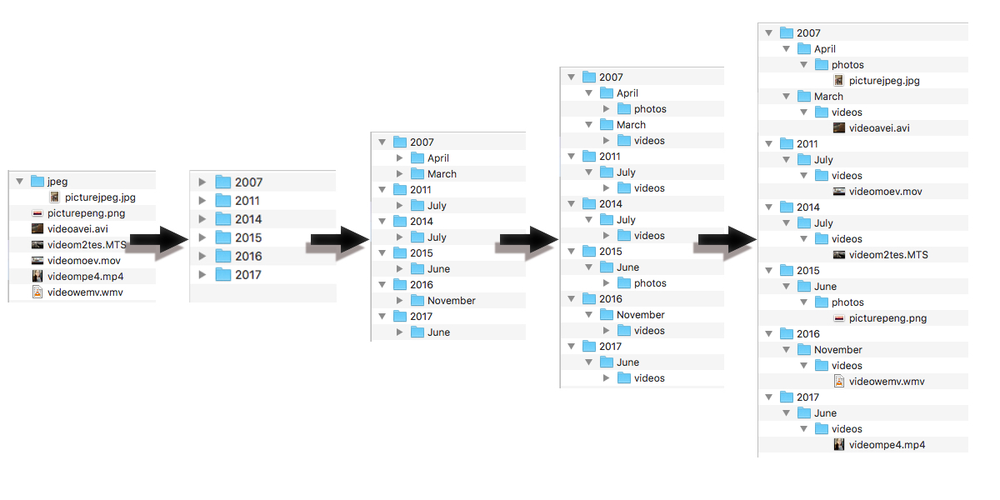

<div id="1">
  
# [Mediarizer](https://github.com/keybraker/Media-Organizer)


Why use Media Organizer:
- Fast and easy organisation of photos / videos by date
- Lightweight, fast and runs on all harware and OS


<br>

---

1. [Mediarizer](#1)
2. [Prerequisite and Build](#2)
   1. [Prerequisites](#2-1)
   2. [Build](#2-2)
   3. [Clean](#2-3)
3. [Usage Guide](#3)
   1. [Flags](#3-1)
   2. [Examples](#3-2)
   3. [Additional Information](#3-3)
4. [Graphical User Interface](#4)
   1. [GUI Installation](#4-1)
   1. [GUI Description](#4-2)
5. [Information](#5)
   1. [Release History](#5-1)
   2. [Acknowledgements](#5-2)

<div id="2">
  
## Building, Installing and Using Mediarizer

<div id="2-1">
  
### Prerequisites
1. Make sure you have downloaded `g++` (on macOS `clang++` which is installed alongside Xcode).
2. Download and install [Exiv2](https://www.exiv2.org/) on your computer.<br>
   **(!)** _if you want to sort videos as well do not forget to add_ `cmake .. -DEXIV2_VIDEO_ENABLE=On` _flag when building_
3. WIP: If you want to achieve better performance you should download OpenMP for multithreading.<br>
   **(!)** _Keep in mind that Mediarizer interacts with the filesystem so there will be only a slight performance improvement as the main bottleneck is the I/O_

<div id="2-2">
  
### Build

1. Open a terminal windows and clone Mediarizer
```bash
https://github.com/keybraker/Mediarizer.git
```

2. Move to Mediarizer directory
```bash
cd Mediarizer
```

3. Compile Mediarizer
```bash
make
```

4. Run Mediarizer ([examples](#3-2))
```bash
./mediarizer ...
```

<div id="2-3">
  
### Clean

1. In the Mediarizer folder type:

```bash
make clean
```

<div id="3">

## Usage Guide

<div id="3-1">

### Flags

| Name       | Acronym      |   Argument   | Description                                                              | State   | Mandatory |
| :--------- | :----------- | :----------: | :----------------------------------------------------------------------- | :------ | :-------- |
| -input     | -i           | path / file  | _gives path to file or directory_                                        | working | yes       |
| -output    | -o           |     path     | _path to output directory_                                               | working | yes       |
| -type      | -t           | tp1, tp2, .. | _organizes *only* given file type/s([image](https://dev.exiv2.org/projects/exiv2/wiki/Supported_image_formats), [video](https://dev.exiv2.org/projects/exiv2/wiki/Supported_video_formats)) | working | no        |
| -photo     | -p           |     none     | _organizes *only* photos_                                                | working | no        |
| -video     | -v           |     none     | _organizes *only* videos_                                                | working | no        |
| -recursive | -r           |     none     | _recursively process sub-directories_                                    | working | no        |
| -date      | -D           |     none     | _if image has no exif date filesystem data is used_                      | no      | no        |
| -move      | -m           |     none     | _move photos that have no metadata to to undetermined folder_            | working | no        |
| -write     | -w           |     none     | _will add exif data to image that has none_                              | no      | no        |
| -delete    | -x           |     none     | _deletes files in source directory_                                      | no      | no        |
| -duplicate | -d           |     none     | _duplicates are moved into duplicate folder in move directory_           | no      | no        |
| -help      | -h           |     none     | _displays a usage guide of Mediarizer_                                   | working | no        |
| -version   | -V           |     none     | _displays current version_                                               | working | no        |
| -verbose   | -s           |     none     | _outputs execution information while running_                            | working | no        |

> a. Multiple flags can be used in conjunction<br>
> b. Multiple file types([image](https://dev.exiv2.org/projects/exiv2/wiki/Supported_image_formats), [video](https://dev.exiv2.org/projects/exiv2/wiki/Supported_video_formats)) can be used as comma-separated string ex: -type jpg,png<br>
> c. Duplicate photos are compared by type, size, date and resolution, only than are they categorized as same<br>

---

<div id="3-2">

### Examples

a. sort single file

```bash
./mediarizer -i /path/media.file -o /path/to/store/folder
./mediarizer --input /path/media.file --output /path/to/store/folder
```

b. sort directory

```bash
./mediarizer -i /path/folder -o /path/to/store/folder
./mediarizer --input /path/folder --output /path/to/store/folder
```

c. sort directory and encapsulated directories

```bash
./mediarizer -i /path/folder -o /path/to/store/folder -r
```

d. flags can be used in any order

```
./mediarizer -o /path/to/store/folder -D -i /path/source/folder -f mp4,jpg,png
```

e. this execution will only sort _mp4_ and _jpg_ files to move direcotry

```bash
./mediarizer -i  /path/source/folder -o /path/to/store/folder -f mp4,jpg
```

f. will only copy photos, _not_ videos:

```bash
./mediarizer -i /path/source/folder -o /path/to/store/folder -photo
```

<div id="3-3">

### Additional Information

> a. photos without exif data can be organized with date of creation in the file system using flag `-D`<br>
> b. when two photos have the same name, only the first encountered is moved to new directory<br>
> c. unsupported files are not being copied<br>
> d. corructed files may cause the program to crash<br>
> e. using cloud storage services like (iCloud, OneDrive, Dropbox, etc) may result in unexpected behaviour 
as data is actually only on remote servers and you locally can see a shortcut of the remote file

---

> if you encounter any problem or error, please report it.<br>
> if you want to contribut please follow the [guidelines](CONTRIBUTING.md).<br>


<div id="4">

## User interface

<div id="4-1">

1. Move to GUI Mediarizer directory
```bash
cd Mediarizer/src/gui
```

2. Compile Mediarizer
```bash
npm install
```

3. Run GUI Mediarizer
```bash
npm start
```

<div id="4-2">

### GUI presentation


<div id="5">

## Information

<div id="5-1">

### Release History

| Version    | Date             |  Argument                                                                                         |
| :--------- | :-----------     | :----------                                                                                       |
| v2.0.0     | 08-12-2020       | _Refactored project and used [Exiv2](https://github.com/exiv2/exiv2)_                             |
| v1.7.0     | 22-08-2017       | _Memory added, for stop and restart_                                                              |
| v1.6.0     | 20-08-2017       | _Fully functional duplication deletion (BETA)_                                                    |
| v1.5.0     | 19-08-2017       | _Added duplication deletion_                                                                      |
| v1.1.2     | 18-08-2017       | _Added -flags for a more controlled organisation_                                                 |
| v1.1.1     | 17-08-2017       | _Now photos and videos are separated in to diffrent folders for maximum organisation_             |
| v1.1.0     | 17-08-2017       | _Huge improvement using [ExifTool](http://owl.phy.queensu.ca/~phil/exiftool/) as processing tool_ |
| v1.0.0     | 12-08-2017       | _Full jpeg release with the help of [easyexif](https://github.com/mayanklahiri/easyexif)_         |
| v0.1.0     | 09-08-2017       | _Initial commit_                                                                                  |

<div id="5-2">

### Acknowledgements

> Acknowledgments - _[Exiv2](https://github.com/exiv2/exiv2)_<br>
> Author - **Ioannis Tsiakkas** - _[Keybraker](https://github.com/keybraker)_<br>
> License - _[GNU LICENSE](http://www.gnu.org/philosophy/free-sw.html)_<br>

Copyrights © Keybraker 2020 [Mediarizer](https://github.com/keybraker/Media-Organizer), All rights reserved
